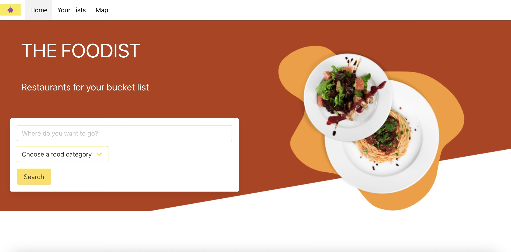
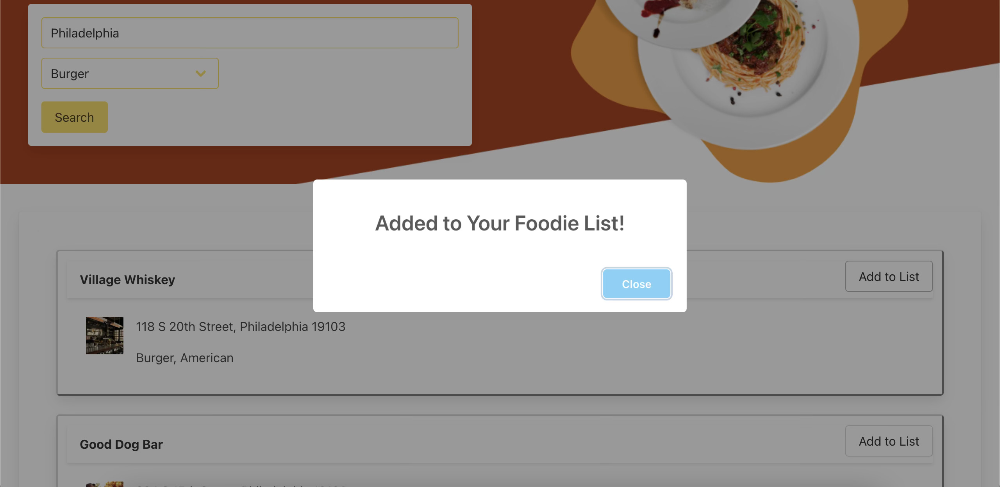
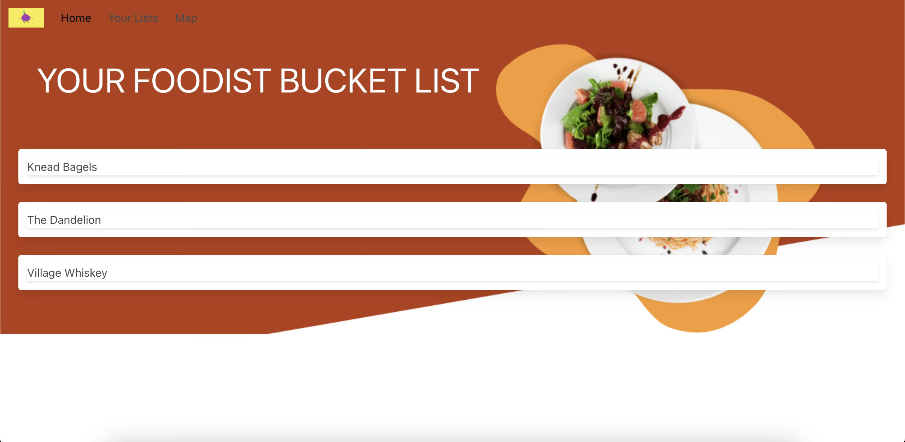

# Overview - Project 1:
Welcome to Project 1! This is an important step in your full-stack journey as you will now use your newly acquired skills and knowledge to build web application from scratch. With your team, you will conceive and execute a design that solves a real-world problem by integrating data received from multiple server-side API requests. Because you will be working collaboratively, you will learn agile development methodologies and implement feature and bug fixes using the git branch workflow and pull requests.

# Task:

For our first project we were tasked with working in groups to create a custom webpage using two server-side APIs, git branching workflow, and agile software development.

# Learning Objectives:

1.) Speak technically about a feature you implemented in your project.
2.) Explain and execute git branching workflow in a collaborative project. 
3.) Resolve merge conflicts. Explain agile software development. 
4.) Design, build, and deploy a client-side web application using GitHub Pages. 
5.) Prepare a professional presentation and repository README for the project.

# The Application:

After brainstorming multiple ideas we settled on an application that used the Zomato and Google Maps APIs to create a restaurant list's application called "Foodist."
The "Foodist" app provides a place for “foodies (people who enjoy eating out at restaurants)” to save restaurants to "Foodie Bucket Lists." Users can discover restaurants based on food type and location to save to their various lists. User's can also use the application's map feature to visually determine the best route to the saved restaurants on their foodie bucket lists.  

# The functions of the webpage are:

1.) When a user searches for a restaurant on the home page based on cuisine and location, the user is presented with a list of twenty restaurants based on the inputted criteria.

2.) When the user clicks the add to list button on the top right corner of a restaurant widget, the user is presented with a pop up that prompts them to add the restaurant to an existing list or create a new one.

3.) When the user visits the list page they are presented with dynamically generated lists based on their inputs on the home page.

4.) When the user visits the maps page they can input a restaurant name or address in the search bar and will be presented with their restaurant located in the center of the map.

5.) When the user inputs a general cuisine they will be presented with multiple instances of those types of restaurants represented by blue icon markers.

# Link to the website:

stevegekas.github.io/foodapp/

# Below are images showing the functional webpages:

## The landing page:

## Creating a list of restaurants based on cuisine type and location:

## Pop up confirming the restaurant is added to the user's list on the lists page:

## Restaurant added to the lists page:

